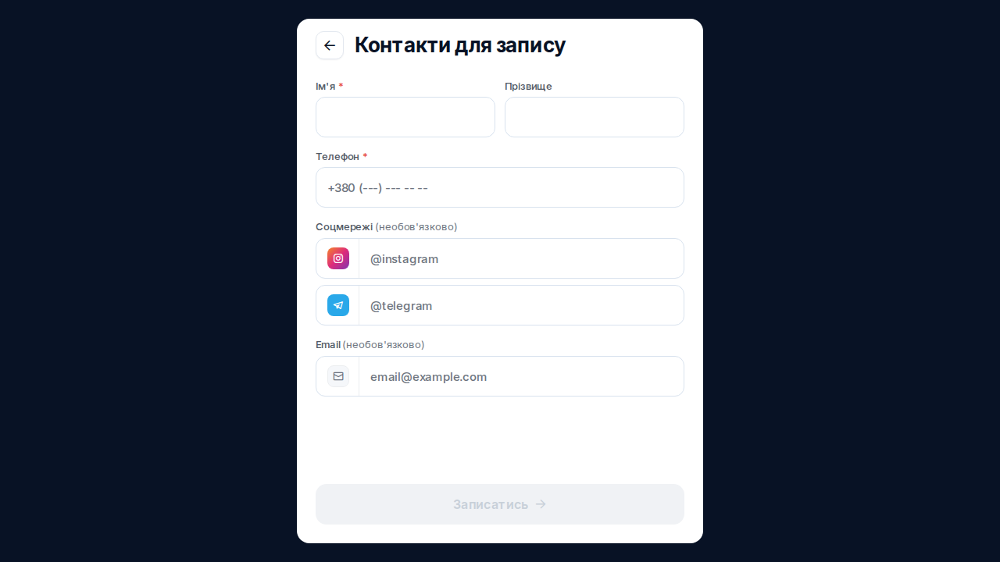
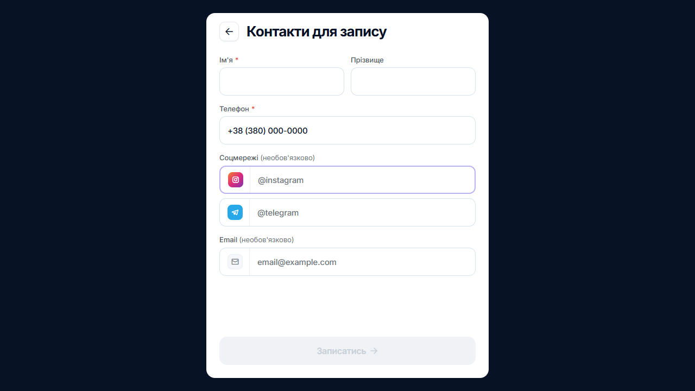

# Natodi bug reports

Two confirmed findings from the September 21, 2026 review (Europe/Kyiv). A third suspected issue was withdrawn after testing the actual clipboard input method. Severity describes user impact; priorities below are QA recommendations. Natodi did not expose an application build number in the inspected UI.

## NTD-001: A free-trial card also states a paid activation

| Field | Details |
| --- | --- |
| Area | Registration, promo, plan selection and checkout |
| Environment | Production admin.natodi.com, Ukrainian UI, desktop Chromium on Windows |
| Severity / proposed priority | Low / P3 |
| Reproducibility | Observed once during registration; post-activation replay redirects to the dashboard |

**Preconditions:** A newly registered account has reached plan selection before activation. The assignment's supplied promo `PRC1NJT` is applied.

**Steps to reproduce**

1. Complete the registration questionnaire and account registration.
2. On the plan-selection screen, apply the supplied promo.
3. Inspect the card labeled `7 днів безкоштовно` and its price.
4. Select that card and inspect checkout before entering payment details.

**Expected:** The offer clearly distinguishes a free period from any activation charge. The plan card and checkout consistently explain the amount due now.

**Actual:** The same card contains `7 днів безкоштовно` and `1.00 грн`; checkout displays `Сплатити 1,00грн`. A user must reconcile the free wording with a nonzero amount before activating the account.

**Impact and scope:** This is a pricing-copy inconsistency, not evidence of an incorrect debit. Checkout does disclose the amount. The review did not establish whether a separate Free-plan route exists or whether every registration route requires payment.

**Evidence:** The original [paywall excerpt](evidence/NTD-001/paywall-excerpt.yml) and [checkout excerpt](evidence/NTD-001/checkout-excerpt.yml) preserve the browser's observed text. [Provenance and hashes](evidence/NTD-001/provenance.json) identify capture times (02:08 and 02:09 Kyiv time). No original pricing screenshot was saved. Reopening the paywall after activation redirected to the dashboard, so no reconstructed image is presented as evidence.

**Regression checks:** Promo and non-promo offers; trial and monthly cards; Ukrainian price wording; consistent amounts between the card and checkout. Recheck in a fresh pre-activation account without charging a card.

## NTD-002: Duplicate input IDs associate both contact labels with the name field

| Field | Details |
| --- | --- |
| Area | Public booking contact form |
| Environment | Production [QA Barbershop 0921](https://book.natodi.com/qa-barbershop-0921), Ukrainian UI, Chromium, 1280 x 720, Playwright 1.63.0 on Ubuntu CI |
| Severity / proposed priority | Medium / P2 |
| Reproducibility | Intermittent; one captured CI occurrence, exact frequency not measured |

**Preconditions:** `QA Haircut` has an assigned employee and available working hours. Open the public page in a fresh browser context.

**Steps to reproduce**

1. Add `QA Haircut`, select an available date and time, and continue to the contact form.
2. Repeat in fresh sessions if necessary; the collision does not occur on every load.
3. Inspect the name and phone input IDs, the corresponding labels' `for` attributes, and the accessibility tree when the collision occurs.

**Expected:** Every input has a unique ID. The name label identifies the name input; the phone label identifies the phone input.

**Actual:** Both inputs had `id="input-25"`. Both labels used `for="input-25"`. The accessibility snapshot named the first textbox `Ім'я * Телефон *`; the phone textbox was identified by its placeholder instead of its intended label. This also broke a locator using the exact name label in the original test.

**Impact:** Assistive technology receives an incorrect combined name for the first field and loses the intended phone label association. A screen-reader user session was not performed; the association failure itself is verified in the DOM and accessibility tree.

**Evidence:** The [original CI run](https://github.com/chernobrovin/playwright_project_template/actions/runs/35545954117) contains the captured failure. The permanent [DOM excerpt](evidence/NTD-002/dom-excerpt.html.txt), [accessibility snapshot](evidence/NTD-002/accessibility-snapshot.yml), and [provenance](evidence/NTD-002/provenance.json) preserve the evidence after the CI artifact expires. The screenshot shows the affected form; the DOM and accessibility snapshot establish the ID collision.

**Test workaround:** Scope each input through its observed `formcontrolname` container. This stabilizes automation without fixing or hiding the product defect.

**Regression checks:** Unique IDs across repeated mounts and fresh sessions; correct accessible names; label-click focus; keyboard and screen-reader navigation.

## Withdrawn finding: International phone-number paste

The earlier report described a clipboard-paste defect, but its reproduction used Playwright `fill()`. These input methods produced different results during the follow-up review on desktop Chromium 153.0.8010.48, Windows, Ukrainian UI.

Test input: `+380000000001`, synthetic data. The form was not submitted.

| Input method | Observed value | Decision |
| --- | --- | --- |
| Actual `Control+V`, trusted browser paste event | `+38 (000) 000-0001` | Digits preserved; clipboard-paste defect withdrawn |
| Playwright `locator.fill()` | `+38 (380) 000-0000` | Method-specific automation behavior; use national digits in tests |

The [recorded comparison](evidence/phone-input-recheck/results.json) retains the event and value evidence. This observation is not counted as a third confirmed product bug.

**Actual clipboard paste**

**Playwright fill comparison**

