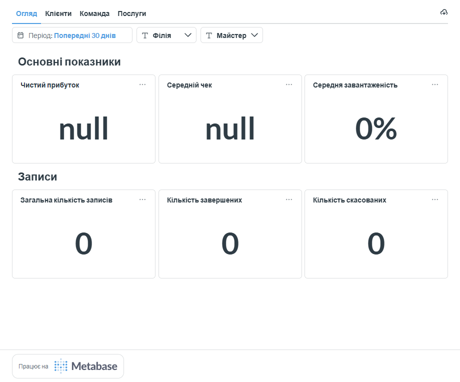
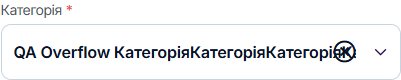
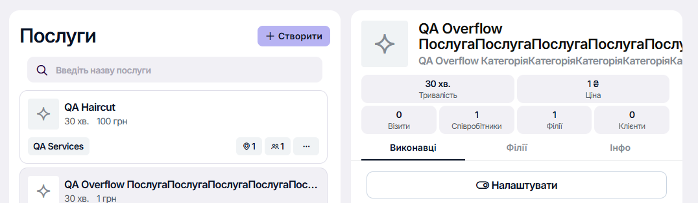
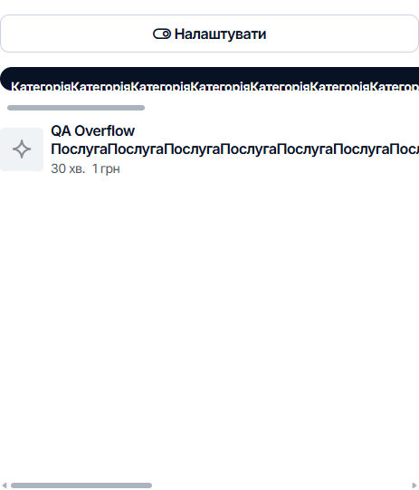

# Natodi bug reports

Three selected findings for the assignment, verified on September 21, 2026 (Europe/Kyiv). The new analytics and long-name reports follow the candidate's manual screenshots and a live reproduction pass. Severity describes demonstrated impact; priorities are QA recommendations. Natodi did not expose an application build number in the inspected UI.

The [review notes](EXPLORATORY_REVIEW.md) explain all six submitted observations, the lower-priority referral-card issue, the plan-limit response, and the earlier pricing finding. NTD-001 retains its original identifier there; it was replaced in this three-report selection, not withdrawn. The unsupported clipboard-paste claim remains withdrawn below.

## NTD-002: Duplicate input IDs associate both contact labels with the name field

| Field | Details |
| --- | --- |
| Area | Public booking contact form |
| Environment | Production [QA Barbershop 0921](https://book.natodi.com/qa-barbershop-0921), Ukrainian UI, Chromium, 1280 x 720, Playwright 1.63.0 on Ubuntu CI |
| Severity / proposed priority | Medium / P2 |
| Reproducibility | Intermittent; one captured CI occurrence, exact frequency not measured |

**Preconditions:** `QA Haircut` has an assigned employee and available working hours. Open the public page in a fresh browser context.

**Steps to reproduce**

1. Add `QA Haircut`, select an available date and time, and continue to the contact form.
2. Repeat in fresh sessions if necessary; the collision does not occur on every load.
3. Inspect the name and phone input IDs, the corresponding labels' `for` attributes, and the accessibility tree when the collision occurs.

**Expected:** Every input has a unique ID. The name label identifies the name input; the phone label identifies the phone input.

**Actual:** Both inputs had `id="input-25"`. Both labels used `for="input-25"`. The accessibility snapshot named the first textbox `Ім'я * Телефон *`; the phone textbox was identified by its placeholder instead of its intended label. This also broke a locator using the exact name label in the original test.

**Impact:** Assistive technology receives an incorrect combined name for the first field and loses the intended phone label association. A screen-reader user session was not performed; the association failure itself is verified in the DOM and accessibility tree.

**Evidence:** The [original CI run](https://github.com/chernobrovin/playwright_project_template/actions/runs/35545954117) contains the captured failure. The permanent [DOM excerpt](evidence/NTD-002/dom-excerpt.html.txt), [accessibility snapshot](evidence/NTD-002/accessibility-snapshot.yml), and [provenance](evidence/NTD-002/provenance.json) preserve the evidence after the CI artifact expires. The screenshot shows the affected form; the DOM and accessibility snapshot establish the ID collision.

**Test workaround:** Scope each input through its observed `formcontrolname` container. This stabilizes automation without fixing or hiding the product defect.

**Regression checks:** Unique IDs across repeated mounts and fresh sessions; correct accessible names; label-click focus; keyboard and screen-reader navigation.

## NTD-003: Empty analytics displays literal null for profit and average check

| Field | Details |
| --- | --- |
| Area | Analytics, Overview, previous 30 days |
| Environment | Production [admin analytics](https://admin.natodi.com/analytics), Ukrainian UI, Chromium 153.0.8010.48 on Windows, 1280 x 900 |
| Severity / proposed priority | Low / P3, incorrect empty-state presentation |
| Reproducibility | Observed on initial load and again after reload on September 21, 2026 |

**Preconditions:** The selected period has no recorded appointments. In this review, total, completed, and cancelled appointment counts all displayed `0`; average workload displayed `0%`.

**Steps to reproduce**

1. Open `Аналітика` in the test account.
2. Select `Огляд` and the period `Попередні 30 днів`, with no branch or employee filter applied.
3. Inspect `Чистий прибуток` and `Середній чек`.
4. Reload the page and inspect the same cards again.

**Expected:** A meaningful localized no-data presentation, such as `Немає даних` or a dash. Use zero only where the metric definition supports it; an undefined average should not be presented as a calculated zero.

**Actual:** Both cards display the literal technical value `null` as their main figure.

**Impact and limits:** A new or inactive business cannot distinguish an empty reporting period from a calculation problem. This confirms a presentation defect; it does not establish an incorrect calculation when revenue exists. No workflow blockage was demonstrated.

**Evidence:** [Recorded values, environment and image checksum](evidence/NTD-003/observations.json). The screenshot includes the selected period and zero appointment counts.

**Regression checks:** Empty and populated periods; new accounts; filters that return no appointments; undefined averages; localized empty-state wording.

## NTD-004: Accepted long service and category names overflow admin controls

| Field | Details |
| --- | --- |
| Area | Service category input, service details, employee services |
| Environment | Production admin.natodi.com, Ukrainian UI, Chromium 153.0.8010.48 on Windows, 1366 x 900 |
| Severity / proposed priority | Low / P3, readability and layout |
| Reproducibility | All three manifestations reproduced; saved-data views reproduced after reload |

**Test data:** Service name = `QA Overflow ` followed by `Послуга` repeated 20 times (152 characters). Category = `QA Overflow ` followed by `Категорія` repeated 16 times (156 characters). Price 1 UAH, duration 30 minutes. These are boundary inputs with long unbroken segments. The application accepted and persisted them. The temporary service was disabled for public self-booking.

**Steps to reproduce**

1. In `Послуги`, create a service with the test names above, an assigned employee, a price and a duration.
2. Select the long category and move focus away from its field. Inspect the clear icon.
3. Save the service, open its details, and inspect the service and category headings. Reload to verify persistence.
4. Open `Персонал`, select the assigned employee, and inspect the category tab and service title under `Послуги`. Reload this view as well.

**Expected:** Accepted text stays within its control and does not overlap actions. Wrap or truncate it with a way to access the full value; reserve space for the clear icon. If such input is unsupported, validation should explain that before saving.

**Actual:**

- The category text paints beneath the clear icon. Its text area extends to x=971.5, while the clear button occupies x=947.5 to 971.5. The clear button still works with an ordinary click.
- In service details, the header has a 479 px content width but a 1967 px scroll width. The names extend outside the visible card area; horizontal scrolling is needed to reach the displaced header actions.
- In employee services, the long category button is 1081 px wide inside a 463 px strip. Its text content needs 31 px vertically inside a 26 px button, clipping the label. The service title also extends beyond the visible content area.

**Impact and limits:** Accepted names become hard to read and distort the layout. Category clearing and switching still work. No booking failure or data loss was demonstrated. These related symptoms form one bounded report; a shared implementation-level root cause has not been established.

**Evidence:** [Test data, DOM measurements, checksums and cleanup results](evidence/NTD-004/observations.json).

**Cleanup:** The temporary service and category were deleted after verification. The original `QA Haircut` remained available. No appointment was created for this check.

**Regression checks:** Short and boundary-length values; spaces and unbroken words; Cyrillic and Latin text; 1280, 1366 and 1920 px widths; clear-icon hit area; service and employee details; readable full values without breaking the layout.

## Withdrawn finding: International phone-number paste

The earlier report described a clipboard-paste defect, but its reproduction used Playwright `fill()`. These input methods produced different results during the follow-up review on desktop Chromium 153.0.8010.48, Windows, Ukrainian UI.

Test input: `+380000000001`, synthetic data. The form was not submitted.

| Input method | Observed value | Decision |
| --- | --- | --- |
| Actual `Control+V`, trusted browser paste event | `+38 (000) 000-0001` | Digits preserved; clipboard-paste defect withdrawn |
| Playwright `locator.fill()` | `+38 (380) 000-0000` | Method-specific automation behavior; use national digits in tests |

The [recorded comparison](evidence/phone-input-recheck/results.json) retains the event and value evidence. This observation is not counted as a third confirmed product bug.

**Actual clipboard paste**

**Playwright fill comparison**

