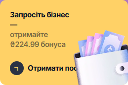
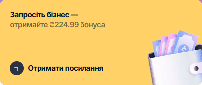
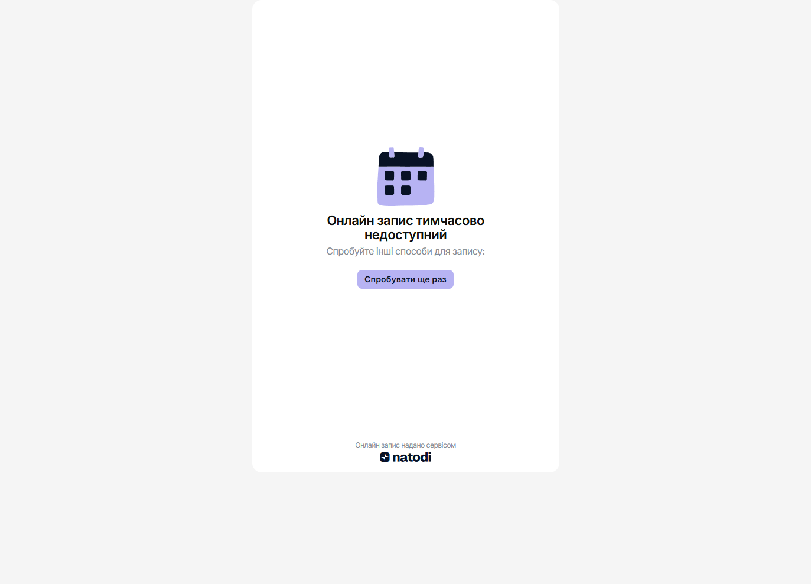

# Review of six manual observations

The candidate supplied six screenshots; the follow-up used the live UI on September 21, 2026. Fresh screenshots below exclude account and payment details. The original screenshots were not committed. A low severity means limited demonstrated impact, not that the issue should be ignored.

## Triage

| Screenshot | Live verification | Decision |
| --- | --- | --- |
| 1: invitation-card label | Illustration overlaps `Отримати посилання` at 1280 and 1366 px; it fits at 1920 px | Confirmed Low / P3 visual issue; supplementary evidence below |
| 2: 20-appointment limit | HTTP 400, business error 4181; UI displays an unavailable-booking state | Not a confirmed defect; actual plan usage of this separate tenant was not verified |
| 3: category clear icon | Long text overlaps the icon, but an ordinary click clears the field | Included in NTD-004; no claim that the button is unusable |
| 4: employee service/category | Category text clips vertically and long content overflows horizontally | Included in NTD-004 |
| 5: service details | Persisted long names extend outside the visible card, also after reload | Included in NTD-004 |
| 6: empty analytics | Profit and average check display `null`; appointment counters display zero, including after reload | Included in NTD-003 |

The assignment allows up to three findings. [BUGS.md](BUGS.md) selects NTD-002 (label association), NTD-003 (analytics empty state), and NTD-004 (long names). The latter groups related boundary-input display symptoms without claiming a proven shared root cause. The one-time pricing-copy finding is retained below for traceability, but the new repeatable cases have stronger evidence for the bounded submission.

## Supplementary: invitation-card label overlaps its illustration

At `Підписка`, inspect the yellow `Запросіть бізнес` card. With a 1366 x 900 viewport, the action container is approximately 136 px wide for 188 px of content, and the illustration covers the end of `Отримати посилання`. The overlap also appears at 1280 px and disappears at 1920 px. The screenshot isolates the card; it contains no stored-card details.

Expected: preserve the complete readable action label and enough space beside the illustration. Severity Low / proposed priority P3. Link-copy behavior was not tested, and no subscription or payment action was performed.

## Not a confirmed defect: Free-plan limit response

The checked page was `https://book.natodi.com/barbershop-kyiv`, a different tenant from `qa-barbershop-0921`. Its branch request returned HTTP 400 with `error_code: 4181` and a message that the Free-plan appointment limit of 20 was exceeded. The UI handled the response by displaying `Онлайн запис тимчасово недоступний` and a retry button.

A failed HTTP request or red Network entry does not by itself establish a product defect. Here the body describes a business restriction rather than an unhandled server failure. The correct HTTP status would require an API contract, and the tenant's actual usage was not independently verified. To establish incorrect enforcement, reproduce this on a controlled account below the limit or with an eligible active plan. No appointments were created on this separate tenant.

[Recorded response, viewport comparison and image checksums](evidence/additional-review/observations.json).

## Earlier finding retained outside the selected three

### NTD-001: A free-trial card also states a paid activation

| Field | Details |
| --- | --- |
| Area | Registration, promo, plan selection and checkout |
| Environment | Production admin.natodi.com, Ukrainian UI, desktop Chromium on Windows |
| Severity / proposed priority | Low / P3 |
| Reproducibility | Observed once during registration; post-activation replay redirects to the dashboard |

**Preconditions:** A newly registered account has reached plan selection before activation. The assignment's supplied promo `PRC1NJT` is applied.

**Steps to reproduce**

1. Complete the registration questionnaire and account registration.
2. On the plan-selection screen, apply the supplied promo.
3. Inspect the card labeled `7 днів безкоштовно` and its price.
4. Select that card and inspect checkout before entering payment details.

**Expected:** The offer clearly distinguishes a free period from any activation charge. The plan card and checkout consistently explain the amount due now.

**Actual:** The same card contains `7 днів безкоштовно` and `1.00 грн`; checkout displays `Сплатити 1,00грн`. A user must reconcile the free wording with a nonzero amount before activating the account.

**Impact and scope:** This is a pricing-copy inconsistency, not evidence of an incorrect debit. Checkout does disclose the amount. The review did not establish whether a separate Free-plan route exists or whether every registration route requires payment.

**Evidence:** The original [paywall excerpt](evidence/NTD-001/paywall-excerpt.yml) and [checkout excerpt](evidence/NTD-001/checkout-excerpt.yml) preserve the browser's observed text. [Provenance and hashes](evidence/NTD-001/provenance.json) identify capture times (02:08 and 02:09 Kyiv time). No original pricing screenshot was saved. Reopening the paywall after activation redirected to the dashboard, so no reconstructed image is presented as evidence.

**Regression checks:** Promo and non-promo offers; trial and monthly cards; Ukrainian price wording; consistent amounts between the card and checkout. Recheck in a fresh pre-activation account without charging a card.
